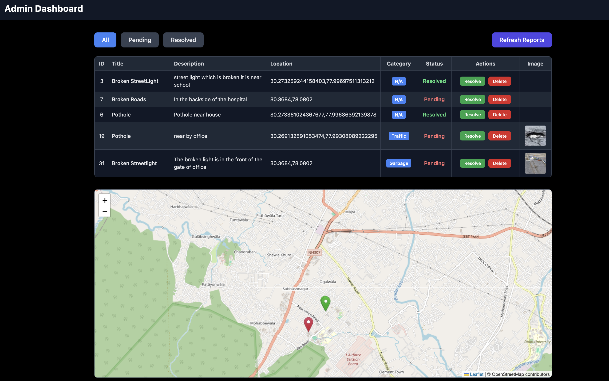

# Civic Issue Complaint Management Platform

A full-stack platform that enables citizens to report civic issues (potholes, streetlights, garbage, etc.) with image uploads and geolocation. Reports are automatically categorized using a Machine Learning model, stored in a database, and displayed to administrators with a map-based dashboard.

---

## Live Demo
- **Frontend (User & Admin dashboards):** [https://civic-issue-complaint-management-pl.vercel.app](https://civic-issue-complaint-management-pl.vercel.app)  
- **Backend API:** [https://civic-issue-complaint-management-platform.onrender.com](https://civic-issue-complaint-management-platform.onrender.com)  
- **ML Service API:** [https://civic-issue-complaint-management.onrender.com](https://civic-issue-complaint-management.onrender.com)  

---

## Features
 User can submit complaints with:  
- Title, Description (with **voice input**)  
- Auto-location (via GPS)  
- Image upload (Supabase bucket storage)

 Automatic **ML-powered categorization** of complaints (Garbage, Road, Lighting, Noise, etc.)  

 Admin Dashboard with:  
- Filter complaints (All / Pending / Resolved)  
- Update/Delete complaints  
- View complaints on **Leaflet interactive map** with status colors  

 Clean UI with **React + Tailwind CSS**  

 Fully deployed with **Render (Backend + ML)** & **Vercel (Frontend)**  

---

##  Screenshots

### Landing Page


### User Dashboard


### Admin Dashboard


---

##  Tech Stack

**Frontend**  
- React + Vite  
- Tailwind CSS  
- React Router  
- Leaflet Maps  

**Backend**  
- Node.js + Express  
- Supabase (Database + Storage)  
- REST APIs  

**Machine Learning**  
- FastAPI  
- Scikit-learn (trained classifier)  
- Joblib for model persistence  

**Deployment**  
- Render (Backend & ML Service)  
- Vercel (Frontend)  

---

##  Local Development

### Clone repo
```bash
git clone https://github.com/01priyanshubisht/Civic-Issue-Complaint-Management-Platform.git
cd Civic-Issue-Complaint-Management-Platform
```

## Backend
cd backend
npm install
npm start

## ML Service
cd ml-service
pip install -r requirements.txt
uvicorn app:app --reload --port 8001

## Frontend
cd frontend
npm install
npm run dev

## Environment Variables
Backend .env
SUPABASE_URL=your-supabase-url
SUPABASE_KEY=your-supabase-anon-key
PORT=8000

Frontend .env.local
VITE_BACKEND_URL=https://civic-issue-complaint-management-platform.onrender.com
VITE_SUPABASE_URL=your-supabase-url
VITE_SUPABASE_KEY=your-supabase-anon-key

## Future Improvements

User authentication (citizens & admins)

Email/SMS notifications for status updates

Advanced analytics for city authorities

Mobile-friendly PWA version

## License

This project is licensed under the MIT License.