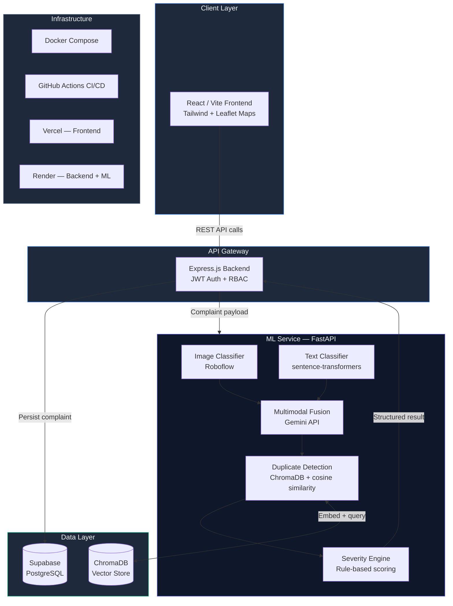

<div align="center">

<!-- HERO BANNER -->


<br/>

[](https://www.typescriptlang.org/)
[](https://python.org)
[](https://reactjs.org/)
[](https://fastapi.tiangolo.com/)
[](https://docker.com)
[](https://supabase.com)

[](https://github.com/features/actions)
[](https://render.com)
[](https://vercel.com)
[](LICENSE)

<br/>

**A full-stack platform that applies computer vision, NLP, and semantic vector search to automate the triage, deduplication, and routing of civic complaints — from pothole reports to infrastructure breakdowns.**

<br/>

[Live Demo](#deployment-links) · [Architecture](#architecture) · [AI Pipeline](#ai-pipeline) · [Local Setup](#docker-setup)

</div>

<br/>

---

## Table of Contents

- [Overview](#overview)
- [Problem Statement](#problem-statement)
- [Key Features](#key-features)
- [AI Pipeline](#ai-pipeline)
- [Architecture](#architecture)
- [Tech Stack](#tech-stack)
- [Folder Structure](#folder-structure)
- [Semantic Duplicate Detection](#semantic-duplicate-detection)
- [Docker Setup](#docker-setup)
- [CI/CD Workflow](#cicd-workflow)
- [Deployment Links](#deployment-links)
- [Environment Variables](#environment-variables)
- [Screenshots](#screenshots)
- [Demo Workflow](#demo-workflow)
- [Future Improvements](#future-improvements)
- [Engineering Highlights](#engineering-highlights)
- [Contributors](#contributors)
- [License](#license)

---

## Overview

CivicAI is a production-deployed, containerized platform that modernizes how municipal complaints are submitted and managed. Citizens submit complaints with text descriptions and optional photos. The system autonomously classifies the issue type, assesses severity, detects semantically similar existing complaints to prevent duplicate entries, and routes tickets to the appropriate department — all before a human ever reviews the submission.

The backend ML pipeline combines a Roboflow-hosted image classification model, Google Gemini for multimodal reasoning, `sentence-transformers` for text embeddings, and ChromaDB as a vector store for real-time similarity search. Everything runs inside Docker Compose and is deployed across Render (backend + ML service) and Vercel (frontend).

---

## Problem Statement

Traditional civic complaint portals are passive intake systems. They suffer from:

- **Duplicate flooding** — citizens re-submit the same issue independently, overwhelming staff
- **Manual triage** — categorization and priority assignment done by hand, introducing delays and inconsistency
- **No geospatial context** — nearby related complaints are never surfaced or linked
- **Opaque routing** — tickets land in a generic queue with no smart assignment

CivicAI addresses each of these directly through an automated AI triage layer that activates the moment a complaint is submitted.

---

## Key Features

| Feature | Description |
|---|---|
| **Image Classification** | Roboflow model identifies issue type (pothole, broken light, garbage, etc.) from uploaded photos |
| **Text Classification** | NLP-based categorization of free-text complaint descriptions |
| **Multimodal Fusion** | Gemini API combines visual and textual signals for a unified assessment |
| **Semantic Deduplication** | `sentence-transformers` + ChromaDB detects near-duplicate complaints by meaning, not keywords |
| **Severity Scoring** | Automated priority scoring (Low / Medium / High / Critical) based on fused AI output |
| **Smart Routing** | Complaints auto-assigned to department based on category and location |
| **Role-Based Access** | JWT-secured RBAC — Citizens, Staff, and Admin roles with distinct permissions |
| **Interactive Map** | Leaflet-based map view showing complaint density and status by area |
| **Admin Dashboard** | Real-time overview of pending, in-progress, and resolved tickets with filter/search |

---

## AI Pipeline

The following pipeline executes on every new complaint submission:

```
Complaint Submitted (text + optional image)
          │
          ▼
┌─────────────────────┐
│  Image Classification│  ← Roboflow hosted model
│  (if image provided) │    Returns: category + confidence
└──────────┬──────────┘
           │
           ▼
┌─────────────────────┐
│  Text Classification │  ← Rule-based + embedding similarity
│                      │    Returns: category label
└──────────┬──────────┘
           │
           ▼
┌─────────────────────┐
│  Multimodal Fusion   │  ← Gemini API
│                      │    Merges image + text signals
│                      │    Returns: unified classification
└──────────┬──────────┘
           │
           ▼
┌─────────────────────┐
│  Semantic Duplicate  │  ← sentence-transformers + ChromaDB
│  Detection           │    Cosine similarity over nearby complaints
│                      │    Returns: duplicate flag + matched IDs
└──────────┬──────────┘
           │
           ▼
┌─────────────────────┐
│  Severity Assessment │  ← Rule engine over fused output
│                      │    Returns: priority score (1–4)
└──────────┬──────────┘
           │
           ▼
┌─────────────────────┐
│  Department Routing  │  ← Category → department mapping
│                      │    Returns: assigned department
└──────────┬──────────┘
           │
           ▼
      Stored in Supabase → Visible in Admin Dashboard
```

---

## Architecture

<details>
<summary><strong>View Architecture Diagram</strong></summary>

<br/>


```mermaid
flowchart TD
    subgraph Client["Client Layer"]
        A[React / Vite Frontend\nTailwind + Leaflet Maps]
    end

    subgraph Gateway["API Gateway"]
        B[Express.js Backend\nJWT Auth + RBAC]
    end

    subgraph ML["ML Service — FastAPI"]
        C1[Image Classifier\nRoboflow]
        C2[Text Classifier\nsentence-transformers]
        C3[Multimodal Fusion\nGemini API]
        C4[Duplicate Detection\nChromaDB + cosine similarity]
        C5[Severity Engine\nRule-based scoring]
    end

    subgraph Storage["Data Layer"]
        D1[(Supabase\nPostgreSQL)]
        D2[(ChromaDB\nVector Store)]
    end

    subgraph Infra["Infrastructure"]
        E1[Docker Compose]
        E2[GitHub Actions CI/CD]
        E3[Vercel — Frontend]
        E4[Render — Backend + ML]
    end

    A -->|REST API calls| B
    B -->|Complaint payload| ML
    C1 --> C3
    C2 --> C3
    C3 --> C4
    C4 --> C5
    C5 -->|Structured result| B
    B -->|Persist complaint| D1
    C4 <-->|Embed + query| D2

    style Client fill:#1e293b,stroke:#3b82f6,color:#f1f5f9
    style Gateway fill:#1e293b,stroke:#3b82f6,color:#f1f5f9
    style ML fill:#0f172a,stroke:#6366f1,color:#f1f5f9
    style Storage fill:#1e293b,stroke:#10b981,color:#f1f5f9
    style Infra fill:#1e293b,stroke:#64748b,color:#f1f5f9
```

</details>

**Service boundaries at a glance:**

```
┌──────────────────────────────────────────────────────────────┐
│                        React Frontend                        │
│                  (Vite + Tailwind + Leaflet)                  │
└───────────────────────────┬──────────────────────────────────┘
                            │ HTTP / REST
┌───────────────────────────▼──────────────────────────────────┐
│                     Express.js Backend                        │
│              JWT Authentication · RBAC · REST API            │
└──────────┬────────────────────────────────────────┬──────────┘
           │ Internal HTTP                          │ SQL
           │                                        │
┌──────────▼──────────────────┐        ┌────────────▼──────────┐
│       FastAPI ML Service     │        │   Supabase PostgreSQL  │
│                              │        └───────────────────────┘
│  ┌────────────────────────┐  │
│  │ Roboflow Image Model   │  │
│  ├────────────────────────┤  │
│  │ sentence-transformers  │  │
│  ├────────────────────────┤  │
│  │ Gemini API             │  │        ┌───────────────────────┐
│  ├────────────────────────┤  │◄──────►│  ChromaDB Vector Store│
│  │ Severity Rule Engine   │  │        └───────────────────────┘
│  └────────────────────────┘  │
└──────────────────────────────┘
```

---

## Tech Stack

<div align="center">

### Frontend
[](https://reactjs.org)
[](https://vitejs.dev)
[](https://www.typescriptlang.org)
[](https://tailwindcss.com)

### Backend
[](https://nodejs.org)
[](https://expressjs.com)

### ML Service
[](https://python.org)
[](https://fastapi.tiangolo.com)

### Database & AI
[](https://supabase.com)

### DevOps
[](https://docker.com)
[](https://github.com/features/actions)
[](https://vercel.com)

</div>

<br/>

| Layer | Technology | Purpose |
|---|---|---|
| Frontend | React 18, Vite, Tailwind CSS | SPA with map view and complaint submission UI |
| Frontend | Leaflet.js | Interactive geospatial complaint map |
| Backend | Node.js, Express.js | REST API, auth middleware, routing logic |
| Backend | JWT + RBAC | Role-aware authentication (Citizen / Staff / Admin) |
| ML Service | FastAPI | Python ML orchestration layer, async endpoints |
| ML Service | Roboflow Inference | Hosted image classification model |
| ML Service | `sentence-transformers` | Text-to-vector embedding generation |
| ML Service | ChromaDB | Persistent local vector store for similarity search |
| ML Service | Google Gemini API | Multimodal fusion and reasoning |
| Database | Supabase (PostgreSQL) | Complaint records, user management, status tracking |
| DevOps | Docker + Docker Compose | Multi-service containerisation |
| CI/CD | GitHub Actions | Automated build validation on every push |
| Deployment | Vercel | Frontend hosting with global CDN |
| Deployment | Render | Backend and ML service hosting |

---

## Folder Structure

```
civicai/
├── frontend/                  # React/Vite SPA
│   ├── src/
│   │   ├── components/        # Reusable UI components
│   │   ├── pages/             # Route-level page components
│   │   ├── hooks/             # Custom React hooks
│   │   ├── services/          # API client functions
│   │   └── types/             # TypeScript type definitions
│   ├── Dockerfile
│   └── vite.config.ts
│
├── backend/                   # Node.js/Express API
│   ├── src/
│   │   ├── routes/            # Express route handlers
│   │   ├── middleware/        # Auth, RBAC, error handling
│   │   ├── controllers/       # Business logic layer
│   │   └── services/          # External service integrations
│   ├── Dockerfile
│   └── package.json
│
├── ml-service/                # FastAPI ML orchestration
│   ├── app/
│   │   ├── routers/           # FastAPI route definitions
│   │   ├── services/          # Roboflow, Gemini, ChromaDB clients
│   │   ├── models/            # Pydantic request/response schemas
│   │   └── core/              # Config and dependency injection
│   ├── Dockerfile
│   └── requirements.txt
│
├── .github/
│   └── workflows/
│       └── ci.yml             # GitHub Actions CI pipeline
│
├── docker-compose.yml         # Multi-service orchestration
└── README.md
```

---

## Semantic Duplicate Detection

This is the most technically interesting component of the system. It answers the question: *"Has someone already reported this same problem, possibly using completely different words?"*

### Why keyword matching falls short

A citizen might write:
- *"The road on MG Road has a big hole"*
- *"There's a crater on the main street near the market"*
- *"Pothole on the highway near Gandhi Square"*

A keyword search for "pothole" finds the third entry but misses the first two. Keyword overlap between two genuine duplicates can be near zero.

### How semantic search works in CivicAI

**Step 1 — Embed the incoming complaint**

When a new complaint is submitted, its text description is passed to the `sentence-transformers` model (`all-MiniLM-L6-v2` or equivalent). The model produces a 384-dimensional dense vector — a numerical representation of the *meaning* of the sentence, not its surface form.

```python
from sentence_transformers import SentenceTransformer

model = SentenceTransformer("all-MiniLM-L6-v2")
embedding = model.encode("The road on MG Road has a big hole")
# → numpy array of shape (384,)
```

**Step 2 — Query ChromaDB for nearby matches**

ChromaDB persists all previously submitted complaint embeddings. At query time, the new embedding is compared against existing vectors using **cosine similarity** — a measure of angular distance between two vectors in high-dimensional space. A score of `1.0` means identical meaning; scores above `0.85` reliably indicate semantic duplicates in practice.

```python
results = collection.query(
    query_embeddings=[embedding.tolist()],
    n_results=5,
    where={"ward": current_ward}   # geospatial pre-filter
)
# Returns closest complaints with similarity scores
```

**Step 3 — Apply geospatial pre-filtering**

To avoid false positives (same issue type, different city), queries are pre-filtered by ward or bounding box. Only complaints within a configurable radius are considered candidates.

**Step 4 — Threshold and flag**

If any result exceeds the similarity threshold, the incoming complaint is flagged as a potential duplicate. The submitter is shown the matched complaint(s), and the backend marks the new submission with a `duplicate_of` foreign key rather than creating a standalone ticket.

### Why this matters

| Approach | Matches "pothole" and "crater" as duplicates? | Handles spelling variation? | Scales with complaint volume? |
|---|---|---|---|
| Keyword matching | No | Partially | Yes (simple) |
| TF-IDF | Rarely | No | Yes |
| Semantic embeddings + ChromaDB | **Yes** | **Yes** | **Yes (vector index)** |

ChromaDB's approximate nearest-neighbour index (HNSW) keeps query latency sub-second even with tens of thousands of stored embeddings — making this viable at real municipal scale.

---

## Docker Setup

All three services (frontend, backend, ML) are containerised and orchestrated via Docker Compose.

**Prerequisites:** Docker Desktop (or Docker Engine + Compose plugin)

### Start all services

```bash
git clone https://github.com/your-username/civicai.git
cd civicai

# Copy and populate environment files
cp backend/.env.example backend/.env
cp ml-service/.env.example ml-service/.env
cp frontend/.env.example frontend/.env

# Build and start all services
docker compose up --build
```

| Service | Local URL |
|---|---|
| Frontend | http://localhost:5173 |
| Backend API | http://localhost:3000 |
| ML Service | http://localhost:8000 |
| ML Docs (Swagger) | http://localhost:8000/docs |

### Stop services

```bash
docker compose down
```

### Rebuild a single service

```bash
docker compose up --build ml-service
```

### docker-compose.yml (simplified)

```yaml
services:
  frontend:
    build: ./frontend
    ports: ["5173:5173"]
    depends_on: [backend]

  backend:
    build: ./backend
    ports: ["3000:3000"]
    env_file: ./backend/.env
    depends_on: [ml-service]

  ml-service:
    build: ./ml-service
    ports: ["8000:8000"]
    env_file: ./ml-service/.env
    volumes:
      - chromadb-data:/app/chroma_db

volumes:
  chromadb-data:
```

ChromaDB data is persisted in a named Docker volume so vector embeddings survive container restarts.

---

## CI/CD Workflow

Every push and pull request to `main` triggers the GitHub Actions pipeline.

```yaml
# .github/workflows/ci.yml
name: CI

on:
  push:
    branches: [main]
  pull_request:
    branches: [main]

jobs:
  frontend-build:
    runs-on: ubuntu-latest
    steps:
      - uses: actions/checkout@v3
      - uses: actions/setup-node@v3
        with: { node-version: "18" }
      - run: cd frontend && npm ci && npm run build

  backend-check:
    runs-on: ubuntu-latest
    steps:
      - uses: actions/checkout@v3
      - uses: actions/setup-node@v3
        with: { node-version: "18" }
      - run: cd backend && npm ci

  ml-service-check:
    runs-on: ubuntu-latest
    steps:
      - uses: actions/checkout@v3
      - uses: actions/setup-python@v4
        with: { python-version: "3.11" }
      - run: cd ml-service && pip install -r requirements.txt
```

**Pipeline stages:**

| Stage | What it validates |
|---|---|
| `frontend-build` | Vite production build completes without errors |
| `backend-check` | All Node.js dependencies install cleanly |
| `ml-service-check` | All Python dependencies install without conflicts |

Deployment to Render and Vercel is triggered automatically on a successful merge to `main` via their respective GitHub integrations.

---

## Deployment Links

| Service | Platform | URL |
|---|---|---|
| Frontend | Vercel | [civicai.vercel.app](#) |
| Backend API | Render | [civicai-backend.onrender.com](#) |
| ML Service | Render | [civicai-ml.onrender.com](#) |

> **Note:** Free-tier Render services cold-start after inactivity. Initial requests may take 30–60 seconds on a fresh start.

---

## Environment Variables

<details>
<summary><strong>Backend — <code>backend/.env</code></strong></summary>

```env
# Server
PORT=3000
NODE_ENV=production

# Supabase
SUPABASE_URL=https://your-project.supabase.co
SUPABASE_ANON_KEY=your-anon-key
SUPABASE_SERVICE_ROLE_KEY=your-service-role-key

# Auth
JWT_SECRET=your-jwt-secret
JWT_EXPIRES_IN=7d

# ML Service
ML_SERVICE_URL=http://ml-service:8000
```

</details>

<details>
<summary><strong>ML Service — <code>ml-service/.env</code></strong></summary>

```env
# Roboflow
ROBOFLOW_API_KEY=your-roboflow-key
ROBOFLOW_PROJECT=your-project-name
ROBOFLOW_VERSION=1

# Gemini
GOOGLE_API_KEY=your-gemini-api-key

# ChromaDB
CHROMA_PERSIST_PATH=/app/chroma_db
CHROMA_COLLECTION_NAME=complaints

# Embedding model
EMBEDDING_MODEL=all-MiniLM-L6-v2
DUPLICATE_SIMILARITY_THRESHOLD=0.85
```

</details>

<details>
<summary><strong>Frontend — <code>frontend/.env</code></strong></summary>

```env
VITE_API_BASE_URL=http://localhost:3000/api
VITE_MAPBOX_TOKEN=your-mapbox-token
```

</details>

---

## Screenshots

> Replace placeholder blocks below with actual screenshots.

<details>
<summary><strong>Landing Page</strong></summary>

```
[ Screenshot: Landing page with hero, features overview, and CTA ]
```

</details>

<details>
<summary><strong>Complaint Submission Form</strong></summary>

```
[ Screenshot: Multi-step complaint form with image upload and map pin drop ]
```

</details>

<details>
<summary><strong>AI Analysis Result</strong></summary>

```
[ Screenshot: Post-submission panel showing detected category, confidence, and severity score ]
```

</details>

<details>
<summary><strong>Semantic Duplicate Detection</strong></summary>

```
[ Screenshot: Duplicate warning with matched complaint details and similarity score ]
```

</details>

<details>
<summary><strong>Admin Dashboard</strong></summary>

```
[ Screenshot: Complaint table with filters, status badges, and routing info ]
```

</details>

<details>
<summary><strong>Map View</strong></summary>

```
[ Screenshot: Leaflet map with clustered complaint markers and sidebar detail panel ]
```

</details>

---

## Demo Workflow

A full end-to-end flow from complaint submission to admin review:

```
1. Citizen registers and logs in
        ↓
2. Opens complaint form → types description, drops map pin, uploads photo
        ↓
3. Submits form → backend forwards payload to ML service
        ↓
4. ML service runs:
     a. Roboflow classifies uploaded image → "Pothole, 91% confidence"
     b. sentence-transformers encodes description text → 384-dim vector
     c. Gemini fuses image label + text → "Road damage, High severity"
     d. ChromaDB query → finds 2 nearby complaints with similarity > 0.85
     e. System flags as duplicate of Complaint #204
        ↓
5. Result stored in Supabase: category=road_damage, severity=HIGH,
   duplicate_of=204, department=public_works
        ↓
6. Citizen sees confirmation: "Similar complaint already reported (Ref #204).
   Your submission has been linked to the existing ticket."
        ↓
7. Admin logs in → dashboard shows Complaint #204 now has 3 linked reports
   → auto-escalates priority to CRITICAL
```

---

## Future Improvements

| Area | Planned Enhancement |
|---|---|
| Notifications | SMS/email alerts when a linked complaint changes status |
| Analytics | Department-level heatmaps and resolution-time dashboards |
| Mobile | React Native companion app for field staff |
| ML Model | Fine-tune image classifier on city-specific complaint categories |
| Clustering | Group nearby complaints automatically into a single parent ticket |
| SLA Tracking | Automated escalation when resolution deadlines are missed |
| Multi-language | Regional language support for complaint text input |
| Offline Mode | PWA with offline submission queue and sync on reconnect |

---

## Engineering Highlights

These are the areas worth discussing in depth during a technical interview:

**Semantic duplicate detection at inference time**
The system embeds and queries ChromaDB synchronously as part of the complaint submission pipeline. This required designing the ML service to be low-latency enough for a synchronous API call — achieved by keeping the embedding model loaded in memory (not re-initialised per request) and using ChromaDB's in-process HNSW index.

**Multimodal fusion via Gemini**
Rather than treating image and text classification as independent outputs, the system sends both results to Gemini with a structured prompt that asks it to arbitrate conflicts and produce a single unified label. This handles cases where the image label and text description disagree (e.g., user uploads a photo of a broken streetlight but writes about road damage).

**Stateless ML service design**
The FastAPI service is stateless except for the persisted ChromaDB volume. This means the ML service can be horizontally scaled or redeployed without losing the vector index, as long as the volume is preserved.

**RBAC middleware in Express**
Roles (Citizen, Staff, Admin) are encoded in the JWT payload and enforced at the route level via a reusable middleware function. Permissions are additive: Admin can do everything Staff can, and Staff can do everything Citizens can plus department-specific actions.

**Docker Compose service dependency graph**
The `ml-service` starts first (it has no external dependencies beyond environment variables). The `backend` starts after, with a health check against the ML service. The `frontend` starts last. This prevents race conditions during `docker compose up`.

---

## Contributors

<table>
  <tr>
    <td align="center">
      <a href="https://github.com/your-username">
        <br/>
        <sub><b>Your Name</b></sub>
      </a><br/>
      <sub>Full-stack · ML Pipeline · DevOps</sub>
    </td>
  </tr>
</table>

---

## License

```
MIT License

Copyright (c) 2024 CivicAI Contributors

Permission is hereby granted, free of charge, to any person obtaining a copy
of this software and associated documentation files (the "Software"), to deal
in the Software without restriction, including without limitation the rights
to use, copy, modify, merge, publish, distribute, sublicense, and/or sell
copies of the Software.
```

---

<div align="center">


*Built with FastAPI, React, sentence-transformers, and ChromaDB.*

</div>
